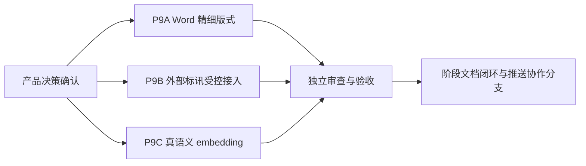

# 包 9：交付增强实施规划

> **实施提示：** 本文仅冻结规划与验收边界。P9A 已按第 3 节的文字版式契约实现；P9B 的来源和受控读取边界已在 `docs/plans/2026-07-13-p9b-chnenergy-watch-plan.md` 单独冻结，仍须遵守该计划的任务拆分；P9C 已由用户授权 Codex 冻结实施决策，必须遵守 `docs/plans/2026-07-14-p9c-offline-semantic-index-plan.md` 的任务拆分和白名单。

**目标：** 将标书制作者的交付能力拆分为 Word 精细版式、外部标讯受控接入和真语义向量检索三个可独立验收的子包。

**架构：** 三个子包不共享数据迁移、网络权限或导出渲染改动，必须分别建立计划、实施、审查和验收提交。现有本地标讯库、标题段落边框、历史哈希向量数据维持可用；P9C 的离线语义索引以版本并存迁移，未经独立计划不得以占位实现替代目标能力。

**技术栈：** FastAPI、SQLAlchemy/SQLite、python-docx、React/TypeScript、Vite、pytest、Playwright。

---

## 1. 当前基线与非目标

| 项目 | 已有能力 | 不能据此宣称完成的能力 |
|---|---|---|
| Word 导出 | 纸张、边距、页眉页脚、页码、标题样式、表格、图片、标题段落边框和分级底色、最小标题左栏 | 整章容器页框、跨页布局规则 |
| 标讯 | 工作空间隔离 CRUD、从标讯立项、UTF-8 CSV/JSON 离线原子导入、`sourceKey` 去重、截止日状态 | 外部站点/API/RSS 自动接入或抓取 |
| 知识检索 | 本地 256 维字符哈希向量、关键词+向量混合检索、可选 OpenAI 兼容 embeddings API | 已调优的真实语义模型、索引迁移和可复现实测效果 |

本包不包含多角色登录、权限控制、MinerU 安装包、Docling 对接、`parseStrategy` 接线或外部资源中心同步扩展。这些事项仍保留在后续阶段，禁止搭车改动。

## 2. 交付顺序与责任边界

| 角色 | 责任 |
|---|---|
| 用户 | 决定第 3 节中的产品和合规前提，提供必要样例或凭据归属规则。 |
| Grok | 仅在公开 GitHub 协作分支或临时公开克隆中，按单一已批准子包编写代码与测试；不得自行提交或扩展范围。 |
| Codex | 冻结范围、审查差异、独立运行测试、核验 Git 状态、编写验收与交接文档。 |

Grok 启动时使用 `HTTP_PROXY`、`HTTPS_PROXY`、`ALL_PROXY=http://127.0.0.1:7890` 及 `NO_PROXY=localhost,127.0.0.1`。协作只使用公开地址 `https://github.com/wmjagpjm/biaoshu.git` 和 `collab/grok-code-codex-review`；不得读取或外发用户未授权的本地内容、密钥或数据库。

## 3. 开工闸门：必须由产品确认的决策

### P9A：Word 精细版式

**已确认文字版式契约（2026-07-13）**：不做整章容器或页框，只实现“最小标题左栏”。详细范围、文件白名单与测试矩阵见 `docs/plans/2026-07-13-p9a-word-layout-plan.md`。

1. 生效对象为各标题分支的叶子标题；正文、列表、表格、封面、目录、页眉和页脚均不纳入。
2. 不创建容器、圆角、填充、分栏、文本框、页面边框或节级版式，因此不存在容器跨页规则。
3. 左栏为标题段落左侧 2.25 pt 实线，颜色复用 `heading_border.border_color`，标题文字与线间距为 6 pt；多行标题按普通段落换行。
4. 技术标与商务标共用该规则；仅当 `heading_border.enabled` 和 `min_heading_left_enabled` 同时开启时生效，已有标题描边与分级底色保留。
5. `heading_border.structure` 继续不接线，不得显示或宣称已支持“上下/左右结构”。

上述文字规则已满足 P9A 开工闸门；P9B 已在 2026-07-13 由用户指定单一来源并冻结独立计划；P9C 已在 2026-07-14 由用户授权 Codex 冻结为离线方案，实施边界以其独立计划为准。

### P9B：外部标讯受控接入

**已确认（2026-07-13）：** 用户指定“国能 e 招（国家能源招标网）”作为 P9B 的唯一来源，并以本机每日 08:30 计划任务的成功检索行为和 Excel 样例说明其实际业务范围。该站未被称为正式开放 API；P9B 仅以固定 HTTPS 主机、固定计划名检索、招标公告类别过滤和低频单条详情读取实现受控接入。

完整的请求上限、Cookie 内存边界、正文解析、允许持久化字段、错误码、人工确认和非目标，以独立计划 `docs/plans/2026-07-13-p9b-chnenergy-watch-plan.md` 为准。禁止浏览器直连、任意 URL/Token 输入、全站抓取、附件下载、原始正文/响应保存或自动立项；现有本地 CSV/JSON 导入语义不变。

### P9C：真语义 embedding 调优

请确认下列方案之一：纯离线模型，或受控的兼容 API。

1. 模型名称、向量维度和中文语料适配要求。
2. 数据是否允许出域；若允许，API 归属、区域、成本上限、超时与限流规则。
3. 旧哈希向量的迁移策略：全量重建、版本并存，或保留旧索引直到完成重建。
4. API/模型不可用时的行为：可见降级提示、任务失败或仅只读关键词检索；不得静默伪装为真语义结果。
5. 评测集来源、脱敏要求、人工相关性标注方法和混合检索权重的验收阈值。

历史本地 256 维哈希向量与可选 API 仅作为兼容基线，P9C 不得再将其作为语义检索结果。2026-07-14 的基线审计、冻结决策和完整实施任务分别记录在 `docs/plans/2026-07-14-p9c-semantic-retrieval-decision-gate.md` 与 `docs/plans/2026-07-14-p9c-offline-semantic-index-plan.md`。

## 3.1 Codex 只读开工审计（2026-07-13）

### P9B 现有接缝与强制边界

- 现有 `POST /api/opportunities/import` 只接收本机 UTF-8 CSV/JSON，受文件大小与行数上限约束，整批校验后单事务写入，原始文件不落盘；该安全语义必须保持。
- `BidOpportunityRow.source_key` 仅是 workspace 内不透明去重键，`source_label` 仅是展示标签；两者都不得承载外部 URL、Token、增量游标、最近成功时间或远端错误。
- 外部接入必须另设服务端来源适配器、来源状态/审计存储和显式同步入口；凭据只能来自服务端环境配置，前端最多接收来源名称、同步状态、时间和统计。
- 来源字段映射、增量游标、限频和数据保留规则均依赖真实授权契约。未指定来源前无法冻结表结构、同步 API 或 E2E，继续写代码会形成无授权的通用抓取器，因此本轮不产生 P9B 代码差异。

### P9B 国内官方来源补充审计（2026-07-13，历史）

本节只记录公开资料与少量只读接口验证；没有抓取公告页面、没有持久化任何外部数据、没有启动 Grok 或产生 P9B 代码差异。目标是为国内标书场景筛掉不能证明“受控读取”的来源，不把页面检索或发布端接口包装成可接入的读 API。

| 候选 | 公开可核验事实 | 结论 |
|---|---|---|
| 全国公共资源交易平台（`https://www.ggzy.gov.cn/`） | 平台公开展示近期交易公告；数据服务页明确可查询中标（成交）信息，但公开页面未给出可供第三方读取交易公告的 API 契约、鉴权方式、限频、游标或存储许可。 | 不以网页检索或页面接口作为同步来源；若后续取得平台的书面 API 接入协议，可重新评估。 |
| 中国政府采购网数据接口规范 V1.0（`https://www.ccgp.gov.cn/sjbzjgf/202403/t20240304_21594369.htm`） | 规范要求 HTTPS 和请求参数数字签名，且说明中去除了访问地址、补充推送参数与返回说明；它是公告/公示的发布对接规范，不是面向投标人的公开读取 API。 | 不可用作 P9B 拉取端；禁止逆向网站搜索接口或借用发布接口。 |
| 天津市开放数据：政府采购招标公告（`https://open.data.tj.gov.cn/sjjk/437ed53ee7294297b41e3308db8cf58e.htm`） | 页面标注“无条件开放”、RESTful GET/POST 和 UTF-8，字段含项目编号、公告发布时间、投标截止时间、采购人/代理机构等；但公开页面未显示实际接口地址，且展示申请目的/安全措施表单，元数据最后更新于 2021-10-25。 | 字段最接近现有标讯模型，但未能证明当前可读接口、访问凭据、限频或更新可靠性；只有用户取得该平台的正式接入资料后才可作为候选。 |
| 北京市公共数据开放平台：政采-采购公告（`https://data.beijing.gov.cn/publish/bjdata/zyml/wnkfsj/86d42a8412c149139805352741353a4d.htm`） | 资源标注无条件开放，使用 API 需注册并携带 `userKey`；页面列出标题、项目编号、正文和发布时间，但没有独立投标截止时间，资源更新时间为 2025-01-21。平台声明可非排他使用且要求注明来源。 | 不足以自动创建可立项标讯；除非取得当期数据和截止时间字段的正式补充契约，否则不接入。 |

**历史结论：** 以上公开资料均不足以作为默认来源，因此没有进入实现范围。此结论不替代用户随后明确指定的“国能 e 招”单站受控读取决策；后者的范围和安全契约仅见 P9B 独立计划，不可借此放开到任何其他网站。

### P9C 现有迁移风险与强制边界

- 当前 API embedding 失败会返回 `None` 并静默退回 256 维本地哈希；这只能作为历史基线，不能作为“真语义”包的失败语义。
- `kb_chunks` 目前只保存 `embedding_json`，没有模型、维度、版本和索引状态；切换模型后，检索查询向量可能与旧分块向量维度不一致，当前 `cosine` 会返回 0 而不提示。
- P9C 必须先建立显式 provider/model/version/dimension 契约、可恢复的版本化重建和用户可见降级，再开展模型效果调权；不得直接覆盖旧向量或用单个演示问句宣称完成。
- 按 A→B→C 顺序，P9B 已完成闭环；P9C 现按冻结的离线实施计划推进，仍不得直接覆盖旧向量或放开到在线 API。

## 4. P9A 实施任务卡（已完成）

### 任务 A1：冻结导出样例与结构映射

**文件：**
- 修改：`docs/plans/2026-07-13-package-9-delivery-enhancement-plan.md`
- 修改：`frontend/src/features/export-format/model/exportFormat.ts`
- 测试：`backend/tests/test_export_heading_border.py`

1. 将确认的标题层级和跨页规则写入本规划的“已确认决策”小节。
2. 先新增失败测试，断言导出 OOXML 的目标段落/表格结构与禁用时的旧样式兼容。
3. 运行定向 pytest，确认当前代码未满足新规则。
4. 只新增必要的配置字段和后端规范化映射；不可改变默认模板导出效果。
5. 运行定向测试并提交单一中文提交。

### 任务 A2：实现 Word 渲染与可视化预览

**文件：**
- 修改：`backend/app/services/export_service.py`
- 修改：`frontend/src/features/export-format/components/TemplateForm.tsx`
- 修改：`frontend/src/features/export-format/components/TemplatePreview.tsx`
- 测试：`backend/tests/test_export_heading_border.py`

1. 先写不同标题层级、跨页和关闭开关的失败测试。
2. 最小化实现 OOXML 渲染；不将布局逻辑散落到业务标/技术标调用处。
3. 让表单、预览和导出使用同一配置语义。
4. 运行 pytest、前端 lint/build，并人工打开生成的 Word 样例验收。
5. 单独提交实现与测试。

## 5. P9B 实施任务卡（独立计划已冻结）

### 任务 B1：定义来源适配器与安全配置契约

**实施边界：** 只允许实施 `docs/plans/2026-07-13-p9b-chnenergy-watch-plan.md` 的任务 1 至任务 5。独立 `opportunity_watch` 服务、路由和表不得与现有 `opportunity_service`/`/api/opportunities/import` 混用；来源没有账号凭据，匿名 Cookie 只在单次服务端运行内存中存在。

1. 先写固定 HTTPS 地址、公告类别过滤、正文截止时间解析和数据最小化的失败测试。
2. 再实现工作空间隔离的计划/运行/命中数据域与 Excel 内存导入。
3. 只实现固定单站服务端适配器和低频背景同步；浏览器不得直接请求来源。
4. 命中必须人工确认后才可创建既有本地标讯，禁止自动创建技术标项目。
5. 按独立计划的定向、全量、前端和 E2E 验收矩阵运行并分别提交。

### 任务 B2：提供可审计同步入口与界面状态

1. 先写 API 与 E2E 失败用例：最近运行、可重试的脱敏错误、解析出的北京时间和本地数据不丢失。
2. 仅展示允许的来源名称、同步状态、统计、服务器生成的公告链接和结构化时间；不展示 Cookie、原始响应或正文。
3. 确保外部同步失败后本地 CSV/JSON 导入仍可用。
4. 运行 pytest、lint/build、单独 E2E 后提交。

## 6. P9C 实施任务卡（已冻结离线模型与数据边界）

### 任务 C1：版本化 embedding 契约和迁移计划

**文件：**
- 修改：`backend/app/services/embedding_service.py`
- 修改：`backend/app/services/knowledge_service.py`
- 修改：`backend/app/services/settings_service.py`
- 修改：`backend/app/api/schemas.py`
- 测试：`backend/tests/test_knowledge_rag.py`

1. 先将模型、维度、数据出域和降级策略写入本规划的已确认决策。
2. 编写失败测试：向量版本不一致、旧索引存在、API 超时、离线模型不可用和可观察降级提示。
3. 实现显式 `embeddingVersion`/维度校验和可恢复重建任务；不得隐式覆盖旧向量。
4. 运行定向 pytest，验证旧知识库仍能被关键词检索且重建过程幂等。
5. 单独提交。

### 任务 C2：评测、混合排序与回归验收

**文件：**
- 新建：`backend/tests/fixtures/<脱敏评测集>.json`
- 修改：`backend/tests/test_knowledge_rag.py`
- 修改：`docs/plans/2026-07-13-package-9-delivery-enhancement-plan.md`

1. 先提交脱敏评测集及相关性判定标准，避免用单一演示问句宣称调优有效。
2. 写失败测试，验证确认的召回阈值、结果稳定性和 API 不可用时的行为。
3. 调整混合排序权重只以评测记录为依据，并记录模型/索引版本。
4. 运行全量后端测试、前端 lint/build；如涉及异步重建，再补充 E2E。
5. 单独提交实现、测试和评测结果摘要。

## 7. 每个子包的固定验收流程

1. Codex 先将范围、非目标和验收命令写入 `docs/plans/`，再向 Grok 发出单一任务。
2. Grok 仅在公开 GitHub 分支/临时克隆中完成未提交差异和测试说明。
3. Codex 审查差异，重点检查工作空间隔离、数据出域、密钥、默认行为与回归面。
4. Grok 根据审查修正后，才提交中文 Commit；Codex 独立运行相应 pytest、`npm run lint`、`npm run build`、必要 E2E 和 `git diff --check`。
5. 验收通过后追加本规划的“已完成证据”，更新 `docs/HANDOFF-next.md`，再推送 `collab/grok-code-codex-review`。

## 8. 当前状态

- P9A 已实现并完成完整独立验收：`c1ff160`（实现P9A最小标题左栏）；自动化检查与 WPS 技术标/商务标实际渲染抽检均通过。实现仅覆盖既有标题边框的叶子标题左侧强调线，未接 `structure` 或页框。
- P9B 已按独立计划完成：解析基础=`45d7214`、数据域=`1c46e41`、Excel 导入=`6491363`、受控同步=`229f1d7`、人工接受=`000b403`、追踪界面与 E2E=`a7cfcb8`。Codex 独立验收为后端 230 passed、前端 lint/build 通过、P9B E2E 1 passed，并已完成固定公告的只读截止时间核验；完整契约和非目标见 `docs/p9b-chnenergy-integration-contract.md`。
- P9B 国内官方来源补充审计仍仅是历史排除证据：全国公共资源交易平台、中国政府采购网、天津/北京开放数据均未形成可直接接入的完整读取契约，不构成对任一来源的接入或背书。
- P9C 已完成实现、独立自动化验收与文档闭环：后端版本化索引=`cc0d217`，状态面板/E2E=`a0bd84b`，运行时模型未就绪降级=`71c503c`，合成评测与本地预检=`585e502`。Codex 独立运行后端全量 **251 passed**、前端 lint/build、语义索引 E2E **9 passed**、知识卡片 E2E **1 passed**与 `git diff --check` 均通过。真实本机模型缓存当前缺失，预检按预期返回 `model_unavailable`/退出码 2；未伪造 Recall@5/NDCG@5。固定契约、部署前置条件和非目标见 `docs/p9c-offline-semantic-index-contract.md`；在用户显式构建并通过真实预检前，知识库保持可见关键词降级。
- P9C-R1 固定离线模型运行时门已在后续全局审计中冻结：固定模型提交、10 个必需文件、约 91.91 MiB 制品、权重 SHA-256、三项直接依赖、显式准备唯一联网路径及生产严格离线加载。当前仍未安装或下载；Grok 只负责六文件受限实现与无网络自测，Codex 才执行真实依赖/制品/合成集预检。契约见 `docs/p9c-fixed-model-runtime-gate-contract.md`，计划见 `docs/plans/2026-07-16-p9c-fixed-model-runtime-gate-plan.md`。
