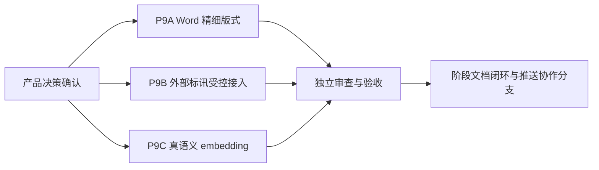

# 包 9：交付增强实施规划

> **实施提示：** 本文仅冻结规划与验收边界。未获得本文件第 3 节的产品决策前，禁止开始包 9 代码实现、提交或推送。

**目标：** 将标书制作者的交付能力拆分为 Word 精细版式、外部标讯受控接入和真语义向量检索三个可独立验收的子包。

**架构：** 三个子包不共享数据迁移、网络权限或导出渲染改动，必须分别建立计划、实施、审查和验收提交。现有本地标讯库、标题段落边框、哈希向量检索维持可用；未经明确决策不得以占位实现替代目标能力。

**技术栈：** FastAPI、SQLAlchemy/SQLite、python-docx、React/TypeScript、Vite、pytest、Playwright。

---

## 1. 当前基线与非目标

| 项目 | 已有能力 | 不能据此宣称完成的能力 |
|---|---|---|
| Word 导出 | 纸张、边距、页眉页脚、页码、标题样式、表格、图片、标题段落边框和分级底色 | 整章容器页框、最小标题左栏、跨页布局规则 |
| 标讯 | 工作空间隔离 CRUD、从标讯立项、UTF-8 CSV/JSON 离线原子导入、`sourceKey` 去重、截止日状态 | 外部站点/API/RSS 自动接入或抓取 |
| 知识检索 | 本地 256 维字符哈希向量、关键词+向量混合检索、可选 OpenAI 兼容 embeddings API | 已调优的真实语义模型、索引迁移和可复现实测效果 |

本包不包含多角色登录、权限控制、MinerU 安装包、Docling 对接、`parseStrategy` 接线或外部资源中心同步扩展。这些事项仍保留在后续阶段，禁止搭车改动。

## 2. 交付顺序与责任边界

| 角色 | 责任 |
|---|---|
| 用户 | 决定第 3 节中的产品和合规前提，提供必要样例或凭据归属规则。 |
| Grok | 仅在公开 GitHub 协作分支或临时公开克隆中，按单一已批准子包编写代码与测试；不得自行提交或扩展范围。 |
| Codex | 冻结范围、审查差异、独立运行测试、核验 Git 状态、编写验收与交接文档。 |

Grok 启动时使用 `HTTP_PROXY`、`HTTPS_PROXY`、`ALL_PROXY=http://127.0.0.1:7890` 及 `NO_PROXY=localhost,127.0.0.1`。协作只使用公开地址 `https://github.com/wmjagpjm/biaoshu.git` 和 `collab/grok-code-codex-review`；不得读取或外发用户未授权的本地内容、密钥或数据库。

## 3. 开工闸门：必须由产品确认的决策

### P9A：Word 精细版式

请确认以下任一形式的版式契约：一份脱敏 Word/PDF 样例或文字规则。

1. 生效标题层级：一级至几级；正文、列表、表格是否纳入容器。
2. 整章容器的边框、圆角、填充、内边距、页边距和页眉/页脚关系。
3. 容器跨页时的规则：允许断开、重复边框，或必须随标题整体换页。
4. 最小标题左栏的宽度、颜色、编号、内容缩进和多行换行规则。
5. 技术标、商务标是否共享同一套规则；已有标题段落边框的兼容/替换规则。

未确认前，`heading_border.structure` 与 `min_heading_left_enabled` 只能保留为前端配置字段，后端不得假接线。

### P9B：外部标讯受控接入

请确认一个已获授权的来源，并提供：

1. 来源名称、正式 API/RSS/导出文件契约及许可证或授权说明。
2. 允许抓取/请求频率、重试规则、时区和增量游标语义。
3. 凭据归属、保管方式、撤销方式；密钥不得进入仓库、日志或 SQLite。
4. 允许持久化的字段及保留期；是否可保存公告正文、附件元数据和原始响应。
5. 失败时的用户体验：展示最近成功时间、可手动重试，且不能破坏现有本地导入记录。

未确认前，只支持现有本地 CSV/JSON 导入；禁止浏览器直连、未授权爬虫、将外部 URL/Token 写入导入文件或复用资源中心同步绕过本边界。

### P9C：真语义 embedding 调优

请确认下列方案之一：纯离线模型，或受控的兼容 API。

1. 模型名称、向量维度和中文语料适配要求。
2. 数据是否允许出域；若允许，API 归属、区域、成本上限、超时与限流规则。
3. 旧哈希向量的迁移策略：全量重建、版本并存，或保留旧索引直到完成重建。
4. API/模型不可用时的行为：可见降级提示、任务失败或仅只读关键词检索；不得静默伪装为真语义结果。
5. 评测集来源、脱敏要求、人工相关性标注方法和混合检索权重的验收阈值。

未确认前，现有本地 256 维哈希回退和可选 API 仅作为基线，不启动模型替换或批量索引重建。

## 4. P9A 实施任务卡（确认版式契约后启用）

### 任务 A1：冻结导出样例与结构映射

**文件：**
- 修改：`docs/plans/2026-07-13-package-9-delivery-enhancement-plan.md`
- 修改：`frontend/src/features/export-format/model/exportFormat.ts`
- 测试：`backend/tests/test_export_heading_border.py`

1. 将确认的标题层级和跨页规则写入本规划的“已确认决策”小节。
2. 先新增失败测试，断言导出 OOXML 的目标段落/表格结构与禁用时的旧样式兼容。
3. 运行定向 pytest，确认当前代码未满足新规则。
4. 只新增必要的配置字段和后端规范化映射；不可改变默认模板导出效果。
5. 运行定向测试并提交单一中文提交。

### 任务 A2：实现 Word 渲染与可视化预览

**文件：**
- 修改：`backend/app/services/export_service.py`
- 修改：`frontend/src/features/export-format/components/TemplateForm.tsx`
- 修改：`frontend/src/features/export-format/components/TemplatePreview.tsx`
- 测试：`backend/tests/test_export_heading_border.py`

1. 先写不同标题层级、跨页和关闭开关的失败测试。
2. 最小化实现 OOXML 渲染；不将布局逻辑散落到业务标/技术标调用处。
3. 让表单、预览和导出使用同一配置语义。
4. 运行 pytest、前端 lint/build，并人工打开生成的 Word 样例验收。
5. 单独提交实现与测试。

## 5. P9B 实施任务卡（确认受控来源后启用）

### 任务 B1：定义来源适配器与安全配置契约

**文件：**
- 修改：`backend/app/services/opportunity_service.py`
- 修改：`backend/app/api/opportunities.py`
- 修改：`backend/app/api/schemas.py`
- 新建：`docs/<已确认来源>-integration-contract.md`
- 测试：`backend/tests/test_opportunities.py`

1. 将授权来源的字段映射、限频、游标和数据保留规则写入契约文档。
2. 先写模拟来源的失败测试：重复游标幂等、超限、异常回滚、跨工作空间隔离和敏感字段不回显。
3. 只实现服务端适配器；浏览器不得直接请求外部来源。
4. 使用环境变量读取凭据，日志中仅记录脱敏状态和统计信息。
5. 运行定向测试并提交。

### 任务 B2：提供可审计同步入口与界面状态

**文件：**
- 修改：`frontend/src/features/bid-opportunity/hooks/useOpportunities.ts`
- 修改：`frontend/src/features/bid-opportunity/**`
- 测试：`backend/tests/test_opportunities.py`
- 测试：`frontend/e2e/<外部标讯同步>.spec.ts`

1. 先写 API 与 E2E 失败用例：最近成功时间、可重试错误、增量结果和本地数据不丢失。
2. 仅展示允许的来源名称、同步状态和统计；不展示密钥、原始 URL 或响应正文。
3. 确保外部同步失败后本地 CSV/JSON 导入仍可用。
4. 运行 pytest、lint/build、E2E 后提交。

## 6. P9C 实施任务卡（确认模型与数据边界后启用）

### 任务 C1：版本化 embedding 契约和迁移计划

**文件：**
- 修改：`backend/app/services/embedding_service.py`
- 修改：`backend/app/services/knowledge_service.py`
- 修改：`backend/app/services/settings_service.py`
- 修改：`backend/app/api/schemas.py`
- 测试：`backend/tests/test_knowledge_rag.py`

1. 先将模型、维度、数据出域和降级策略写入本规划的已确认决策。
2. 编写失败测试：向量版本不一致、旧索引存在、API 超时、离线模型不可用和可观察降级提示。
3. 实现显式 `embeddingVersion`/维度校验和可恢复重建任务；不得隐式覆盖旧向量。
4. 运行定向 pytest，验证旧知识库仍能被关键词检索且重建过程幂等。
5. 单独提交。

### 任务 C2：评测、混合排序与回归验收

**文件：**
- 新建：`backend/tests/fixtures/<脱敏评测集>.json`
- 修改：`backend/tests/test_knowledge_rag.py`
- 修改：`docs/plans/2026-07-13-package-9-delivery-enhancement-plan.md`

1. 先提交脱敏评测集及相关性判定标准，避免用单一演示问句宣称调优有效。
2. 写失败测试，验证确认的召回阈值、结果稳定性和 API 不可用时的行为。
3. 调整混合排序权重只以评测记录为依据，并记录模型/索引版本。
4. 运行全量后端测试、前端 lint/build；如涉及异步重建，再补充 E2E。
5. 单独提交实现、测试和评测结果摘要。

## 7. 每个子包的固定验收流程

1. Codex 先将范围、非目标和验收命令写入 `docs/plans/`，再向 Grok 发出单一任务。
2. Grok 仅在公开 GitHub 分支/临时克隆中完成未提交差异和测试说明。
3. Codex 审查差异，重点检查工作空间隔离、数据出域、密钥、默认行为与回归面。
4. Grok 根据审查修正后，才提交中文 Commit；Codex 独立运行相应 pytest、`npm run lint`、`npm run build`、必要 E2E 和 `git diff --check`。
5. 验收通过后追加本规划的“已完成证据”，更新 `docs/HANDOFF-next.md`，再推送 `collab/grok-code-codex-review`。

## 8. 当前状态

- 规划已建立；P9A、P9B、P9C 均处于“等待产品决策”状态。
- 未开始任何包 9 实现，未产生包 9 代码提交或推送。
- 收到第 3 节任一子包的完整决策后，只启动对应子包，不并行扩展其余两个子包。
